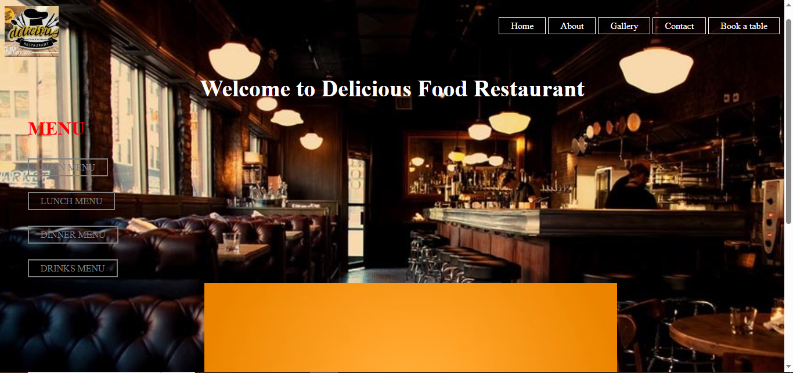

# 🍽️ Delicious Food Restaurant Website
A professional, high-quality restaurant website featuring a dynamic menu and video integration.

---

## 📸 Website Preview
Here is a glimpse of the project:

---

## 🚀 Live Project Link
Experience the live website here:  
👉 **[View Live Demo](https://mhusnain-tech.github.io/Restaurants-Website/)**

---

## 📁 File Architecture
I have organized the project into a clean folder structure for better management:

- **Root Directory:** Contains `index.html` (the entry point of the website) and documentation.
- **`/pages` Folder:** Contains all internal navigation pages like `privacy.html`, `termcondition.html`, etc.
- **`/images` Folder:** All website assets, logos, and menu item images are stored here.
- **`/video` Folder:** Contains the restaurant's promotional video.

---

## 🛠️ Key Features
- **Clean Navigation:** Main menu, gallery, and contact links.
- **Folder Optimization:** All assets are linked via relative paths for seamless hosting.
- **Interactive Elements:** Video player with autoplay and custom CSS hover effects.
- **Professional Footer:** Includes essential links like Terms & Conditions and Privacy Policy.

---

## 🔧 Installation & Setup
To run this project locally:
1. Clone this repository.
2. Ensure you keep the folder structure intact (don't move files out of `/pages` or `/images`).
3. Open `index.html` in your browser.

---

## 👤 Author
**M. Husnain** *Passionate Web Developer* [GitHub Profile](https://github.com/mhusnain-tech)

---
*Last updated: 2026*
